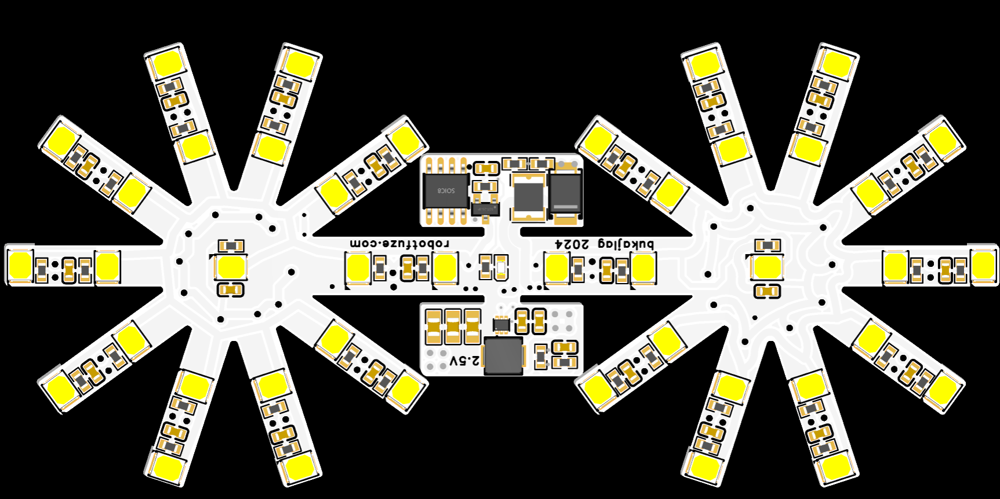

# IR golf ball

# What / Why it is?
A golf size ball emiting IR light powered by 18350 Li-Ion battery with 40khz modulation (8 pulzes of 40khz then off with period of 1.2khz)

# How to get it?

## Buy it and suport us
You will be able to buy it soon from many places, for now we are taking preorders [here](https://docs.google.com/forms/d/e/1FAIpQLSeDNluafNvnX1WBIk5zJzcXsfOrKENFUOebmqeOT6po7Bbjzg/viewform?usp=sf_link) cost is 20$ per ball build without battery

## Make it your self
## Step 1: Get all materials
You will be able to order kit from us or you can source all neaded components by your self.
### 1. Flex PCB
We recomend to order flexPCB from eather JLCPCB or PCBWAY, both do have sponsorship programs so you might be able to get it for free. Depending on your buget and skill set also think about ordering stencil (all componentc are posible to solder by hand soledring but it is easier to do it with stencil)

https://www.pcbway.com/sponsor.html
https://jlcpcb.com/help/article/how-to-apply-for-free-pcb

All gerber files are in this repo.

### 2. Electrical components
<table>
  <thead>
    <tr>
      <th>Image</th>
      <th>Quantity</th>
      <th>Comment</th>
      <th>Footprint</th>
      <th>Value</th>
      <th>Manufacturer Part</th>
    </tr>
  </thead>
  <tbody>
    <tr>
      <td></td>
      <td>24</td>
      <td>22uF</td>
      <td>C0603</td>
      <td>22uF</td>
      <td>GRM188R60J226MEA0D</td>
    </tr>
    <tr>
      <td></td>
      <td>3</td>
      <td>47uF</td>
      <td>C0805</td>
      <td>47uF</td>
      <td>C2012X5R1A476MTJ00E</td>
    </tr>
    <tr>
      <td></td>
      <td>1</td>
      <td>4.7nF</td>
      <td>C0603</td>
      <td>4.7nF</td>
      <td>CC0603KRX7R9BB472</td>
    </tr>
    <tr>
      <td></td>
      <td>1</td>
      <td>120pF</td>
      <td>C0603</td>
      <td>120pF</td>
      <td>CL10C121JB8NNNC</td>
    </tr>
    <tr>
      <td></td>
      <td>1</td>
      <td>SS1045-SMB</td>
      <td>SMB_L4.4-W3.6-LS5.3-RD</td>
      <td></td>
      <td>SS1045-SMB</td>
    </tr>
    <tr>
      <td></td>
      <td>1</td>
      <td>220nH</td>
      <td>IND-SMD_L4.1-W4.1</td>
      <td>220nH</td>
      <td>IHLP1616BZERR22M01</td>
    </tr>
    <tr>
      <td></td>
      <td>42</td>
      <td>XL-2835IR-T202</td>
      <td>SMD2835</td>
      <td></td>
      <td>XL-2835IR-T202</td>
    </tr>
    <tr>
      <td></td>
      <td>1</td>
      <td>XL-1608SURC-06</td>
      <td>LED0603</td>
      <td></td>
      <td>XL-1608SURC-06</td>
    </tr>
    <tr>
      <td></td>
      <td>1</td>
      <td>AP3404</td>
      <td>SOT-23-3</td>
      <td></td>
      <td>AP3404</td>
    </tr>
    <tr>
      <td></td>
      <td>42</td>
      <td>10Ω</td>
      <td>R0603</td>
      <td>10Ω</td>
      <td>0603WAF100JT5E</td>
    </tr>
    <tr>
      <td></td>
      <td>3</td>
      <td>10k</td>
      <td>R0603</td>
      <td>10k</td>
      <td>RC0603FR-0710KL</td>
    </tr>
    <tr>
      <td></td>
      <td>1</td>
      <td>316kΩ</td>
      <td>R0603</td>
      <td>316kΩ</td>
      <td>RC0603FR-07316KL</td>
    </tr>
    <tr>
      <td></td>
      <td>1</td>
      <td>100kΩ</td>
      <td>R0603</td>
      <td>100kΩ</td>
      <td>RC0603FR-07100KL</td>
    </tr>
    <tr>
      <td></td>
      <td>1</td>
      <td>100Ω</td>
      <td>R0603</td>
      <td>100Ω</td>
      <td>0603WAJ0101T5E</td>
    </tr>
    <tr>
      <td></td>
      <td>1</td>
      <td>ATTINY202-SSNR</td>
      <td>SOIC-8</td>
      <td></td>
      <td>ATTINY202-SSNR</td>
    </tr>
    <tr>
      <td></td>
      <td>1</td>
      <td>TPS62A06DRLR</td>
      <td>SOT-563-6</td>
      <td></td>
      <td>TPS62A06DRLR</td>
    </tr>
    <tr>
      <td></td>
      <td>1</td>
      <td>1812L400/12GR</td>
      <td>F1812</td>
      <td></td>
      <td>1812L400/12GR</td>
    </tr>
  </tbody>
</table>

We recomend ordering from LCSC but you can find all the componets on other sites as well (Mouser,Digikey...). For finding best suplier for you, we recomend using https://octopart.com/ and checking out list of eqvivalent componts (TODO list of eqvivalent components)

### 3. Mechanical components
#### Filament
Shells are 3D printed, after lot of testing we found out that best option in general is using [PCTG](https://shop.spectrumfilaments.com/product-eng-1414-Filament-Spectrum-Premium-PCTG-1-75mm-PURE-ORANGE-1kg-RAL-2004.html) for good optical properties/cheap/easy to print/mechanical properties similar to PC. But PC is also posible to use.

#### Magnets
For magnets we are using 6 [6mm*5mm](https://www.unimagnet.cz/neodymovy-magnet-kotouc-6-mm-v-5-mm-sila-1-2-kg_z323/) N42 neodimium magnets. 

#### Brass 
For ball balancing we are using 6mm brass rod cuted into 6*5mm peaceas. We chose brass rod because it is really easy to find and it is cheap it has high density and it is not toxick.

#### Glue
Any superglue will work fine

### 4. Battery
We are using 18350 Li-Ion battery. We recomend capacity ranging from 1100mAh to 1200mAh (for balance reasons). It schold be easy to find in your local vape shop or battery store. Dont forget to get charger if you dont have one.

## Step 2: Print 3D shells
You can find stl files as well as sliced model in prushaslicer in 3d in this repo. Main thing to look for is to use enought of separation distance for suports (0.35mm) and to set temperature of bad to 100 C and nozle to 250 C.
Also print counterwight for balance and fill it with solder.

## Step 3: Asemble PCBs
While your 3d printer is working you can asemble PCBs. It can be done by hand but stencil is more convinient. We recomend to place coil as last component so you will be able to rework regulator solder joints if neaded after reflow.

## Step 4: Program AtTiny
This step is not neaded when you did buy a kit from us. 
The best way to aproach this is to watch this video: https://www.youtube.com/watch?v=AL9vK_xMt4E
and upload code as mention in the video. Dont forget to contect 3.3V to 2.5V trace when programing so UDPI voltages do match.

Also you schold test your PCB by using baterry if all LEDs are on.
TODO make video how to do it for our PCB

## Step 5: Cut brass rod
Now you nead to cut that 6mm btass rod into 5mm pieces, you will nead 12 of them. 

## Step 6: Insert magnets and brass rods into shells
Now you will nead to insert magnets and brass rods into 3D printed shells and glue it in using superglue. And wait till it will dry.

## Step 7: Insert PCB
Insert PCB into a 3D printed schells and make shure that baterry fits corectly. You can regulate contact of batery with PCB by adding or removing solder from battery contact pads that are on the PCB.

## Step 8: Test
Test your ball if it glows using your mobile phone.

The end (:
